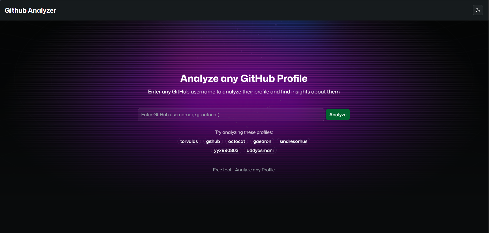
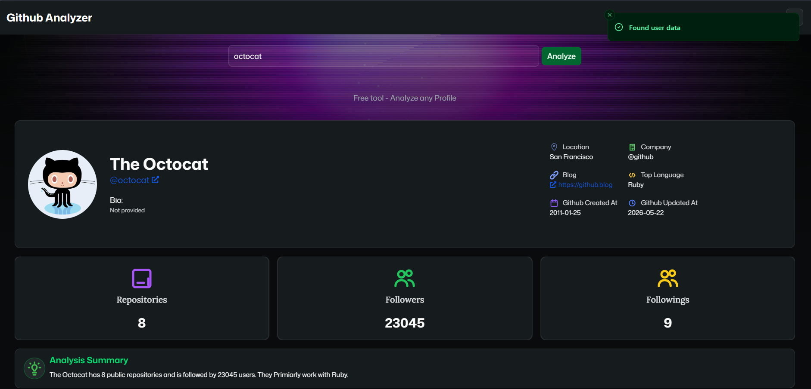
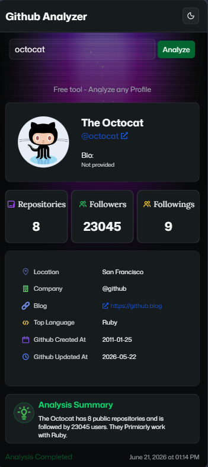
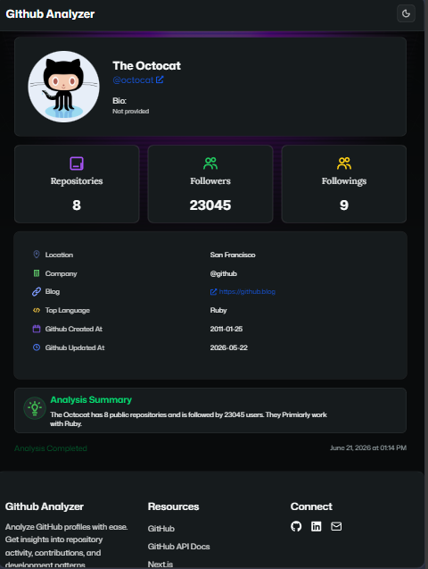

# GitHub Profile Analyzer

This project was built to gain hands-on experience with Next.js, Tailwind CSS, shadcn/ui, and TypeScript while creating a practical GitHub profile analysis tool. This project is actively maintained, with ongoing improvements focused on performance, analytics, caching, enhanced GitHub insights, and better user experience.

## Overview

Built a full-stack GitHub analytics dashboard that analyzes public GitHub profiles and stores analysis history through a backend API.\
This is the frontend repository. If you want you can check backend repository here: https://github.com/deshyam01/github-profile-analyzer-api

## Live Demo

**Live Application**: https://github-profile-analyzer-six-omega.vercel.app/

**Backend Repository**: https://github.com/deshyam01/github-profile-analyzer-api

## Features

- Interactive search system for analyzing GitHub profiles by username
- Suggested sample profile badges for quick one click search
- Validation of username to prevent invalid searches
- Responsive search interface with a modern gradient hero section
- Clean profile overview cards with avatar, name, username, bio, and profile link
- Show useful profile metadata including location, company, blog url, top language
- Displays key GitHub statistics such as repositories, followers, and following count
- Automatically generates a profile summary based on fetched GitHub data
- Easy Light / Dark / System theme switching
- System theme preference by default
- Responsive layout for better usability across multiple devices
- Error handling for invalid or unavailable github usernames

## Tech Stack

##### Frontend

- Next.js
- Tailwind CSS
- Used Typescript for type safety in runtime & improved development experience.
- Used Shadcn ui for components

##### HTTP Client

- Axios

##### Backend

- Node.js
- Express.js

##### Database

- MySQL

##### Deployment

- Vercel (Frontend)
- Render (Backend)

##### Version Control

- Git
- GitHub

## Screenshots

- **Landing page**:
  
- **Sample profile**:
  
- **Responsiveness**:

| Mobile                                   | Tablet                                   |
| ---------------------------------------- | ---------------------------------------- |
|  |  |

## Installation

##### 1. Clone the Repository:

```bash
git clone https://github.com/DeShyam01/github-profile-analyzer.git
```

##### 2. Navigate to the project directory:

```bash
cd github-profile-analyzer
```

##### 3. Install dependencies:

```bash
npm install
```

##### 4. Setup .env.local file:

Create `.env.local` file and add the required env variable

```env
GITHUB_ANALYZER_API_URL=YOUR_BACKEND_API_URL
```

##### 5. Start the development server:

```bash
npm run dev
```

##### 6. Open the App:

Open browser and search this url

```
http://localhost:3000
```

## Usage

- Search for any GitHub username.
- Analyze the profile to retrieve GitHub data.
- View profile information, statistics, and insights.
- Use suggested profiles for quick testing.
- Switch between light and dark themes for a better viewing experience.

## Project Structure

```text
github-profile-analyzer/
├── public/
│   └── icons/
│── lib/
│   ├── constants.ts
│   └── api.ts
├── src/
│   ├── app/
│   │   ├── layout.tsx
│   │   ├── page.tsx
│   │   ├── globals.css
│   │   └── ThemeProvider.tsx
│   ├── components/
│   │   ├── Header.tsx
│   │   ├── Footer.tsx
│   │   ├── ThemeToggle.tsx
│   │   ├── AnalysisReport.tsx
│   │   ├── animate-ui/
│   │   └── ui/
│   ├── types/
│   │   └── profiles.ts
│   └── services/
│       └── github.ts
├── .env
├── package.json
└── README.md
```

| Folder / Files            | Description                                                                                            |
| ------------------------- | ------------------------------------------------------------------------------------------------------ |
| public/                   | Static assets like icons for the app                                                                   |
| lib/constants.ts          | Stores reusable application constants used throughout the application.                                 |
| lib/api.ts                | Configures and exports a centralized Axios instance for handling API requests, and base URLs settings. |
| src/app/                  | Next.js App Router pages and layouts                                                                   |
| src/components/           | Reusable UI components                                                                                 |
| src/components/ui         | Reusable UI components from shadcn ui                                                                  |
| src/components/animate-ui | Animated UI component used in hero section                                                             |
| src/types/                | Typescript interfaces for profile                                                                      |
| src/services/             | Helper function for communicating with backend api                                                     |
| .env                      | Environment variables                                                                                  |
| package.json              | Application dependencies, and information                                                              |
| README.md                 | Detailed project description                                                                           |

## Challenges Faced

- Integrating frontend and backend services while maintaining a clean and scalable project structure.
- Handling invalid and non-existent GitHub usernames while providing clear feedback to users.
- Designing a responsive layout that works consistently across desktop and mobile devices.
- Managing loading and error states during API requests to improve user experience.
- Ensuring UI components remained readable and visually consistent in both light and dark themes.
- Implemented username validation to prevent unnecessary API requests.

## Key Learnings

- Learned and applied the Next.js App Router architecture in a real-world project.
- Built reusable and accessible UI components using shadcn ui.
- Developed responsive interfaces with Tailwind CSS utility-first styling.
- Applied TypeScript throughout the frontend to improve type safety and developer experience.
- Gained practical experience organizing a larger codebase with reusable components, utility modules, and shared types.
- Improved understanding of API integration, loading states, error handling, and user experience considerations.

## Future Improvements

- Add Profile scoring system to enhance the usability this project.
- Add repository-level analytics such as stars, forks, and language distribution charts.
- Implement profile analysis caching to reduce API requests and improve response times.
- Enhance accessibility and user experience across a wider range of devices.
- Add profile export functionality (PDF/Image) for sharing analysis reports.
- Expand analysis with more detailed metrics and visual dashboards.
- Continue refining the UI and adding new features based on user feedback.

## Contributing

Contributions, suggestions, and feedback are welcome. Feel free to open an issue or submit a pull request.

## Author

Built and maintained by **Shyamsundar Gayen** as part of my journey learning Next.js, TypeScript, Tailwind CSS, and modern frontend development. The project is actively maintained and will continue to receive new features and improvements.

- GitHub: [@DeShyam01](https://github.com/DeShyam01)
- LinkedIn: [Shyamsundar Gayen](https://www.linkedin.com/in/shyamsundar-gayen-77a904309)
